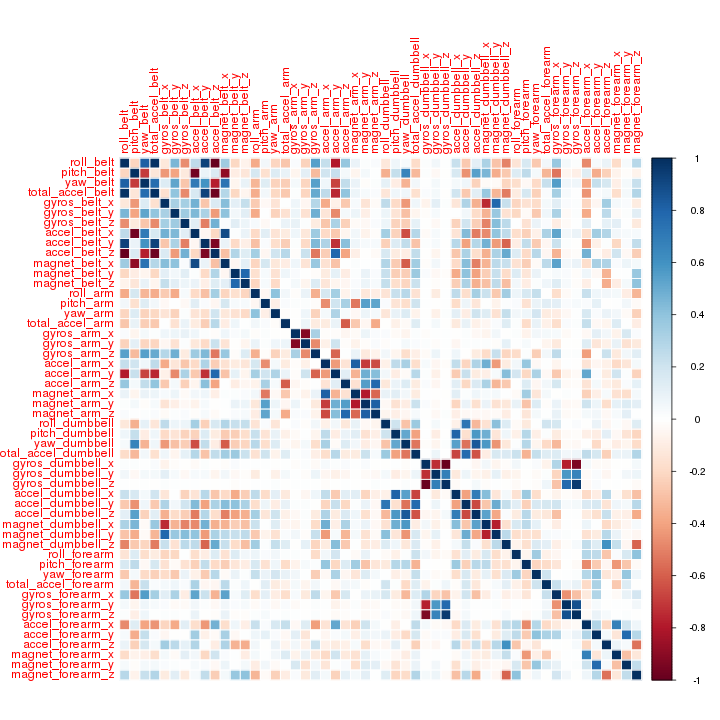
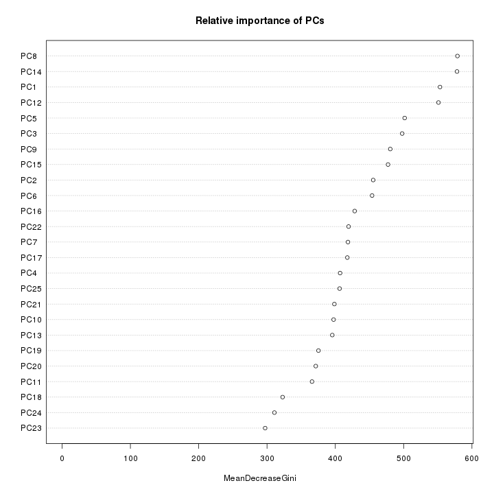

Predictive model for activity recognition of weight lifting exercises
=================================================================

**by Ankit Jain**

# Summary

Using devices such as Jawbone Up, Nike FuelBand, and Fitbit it is now possible to collect a large amount of data about personal activity relatively inexpensively. In this project, our goal will be to use data from accelerometers on the belt, forearm, arm, and dumbell of 6 participants. They were asked to perform barbell lifts correctly and incorrectly in 5 different ways.

We will fit a model to predict the manner in which the participants did the exercise, to achieve this we will use a random forest algorithm and a 5-fold cross validation. Our predicted results achieve 100% accuracy on the limited test dataset provided.

# Data processing

## Data cleaning

First we need to download the train and test files.


```r
download.file("https://d396qusza40orc.cloudfront.net/predmachlearn/pml-training.csv", "pml-training.csv", method = "curl")
download.file("https://d396qusza40orc.cloudfront.net/predmachlearn/pml-testing.csv", "pml-testing.csv", method = "curl")
```

Then we read the csv file into two data frames named "pml.training" and "pml.testing".


```r
pml.training.raw<- read.csv("pml-training.csv")
pml.testing.raw <- read.csv("pml-testing.csv")
```

The training set consists in 19622 observations of 160 variables and the testing set consists in 20 observations of 160 variables. The "classe" variable is the dependent variable.


```r
names(pml.training.raw)
```

```
##   [1] "X"                        "user_name"               
##   [3] "raw_timestamp_part_1"     "raw_timestamp_part_2"    
##   [5] "cvtd_timestamp"           "new_window"              
##   [7] "num_window"               "roll_belt"               
##   [9] "pitch_belt"               "yaw_belt"                
##  [11] "total_accel_belt"         "kurtosis_roll_belt"      
##  [13] "kurtosis_picth_belt"      "kurtosis_yaw_belt"       
##  [15] "skewness_roll_belt"       "skewness_roll_belt.1"    
##  [17] "skewness_yaw_belt"        "max_roll_belt"           
##  [19] "max_picth_belt"           "max_yaw_belt"            
##  [21] "min_roll_belt"            "min_pitch_belt"          
##  [23] "min_yaw_belt"             "amplitude_roll_belt"     
##  [25] "amplitude_pitch_belt"     "amplitude_yaw_belt"      
##  [27] "var_total_accel_belt"     "avg_roll_belt"           
##  [29] "stddev_roll_belt"         "var_roll_belt"           
##  [31] "avg_pitch_belt"           "stddev_pitch_belt"       
##  [33] "var_pitch_belt"           "avg_yaw_belt"            
##  [35] "stddev_yaw_belt"          "var_yaw_belt"            
##  [37] "gyros_belt_x"             "gyros_belt_y"            
##  [39] "gyros_belt_z"             "accel_belt_x"            
##  [41] "accel_belt_y"             "accel_belt_z"            
##  [43] "magnet_belt_x"            "magnet_belt_y"           
##  [45] "magnet_belt_z"            "roll_arm"                
##  [47] "pitch_arm"                "yaw_arm"                 
##  [49] "total_accel_arm"          "var_accel_arm"           
##  [51] "avg_roll_arm"             "stddev_roll_arm"         
##  [53] "var_roll_arm"             "avg_pitch_arm"           
##  [55] "stddev_pitch_arm"         "var_pitch_arm"           
##  [57] "avg_yaw_arm"              "stddev_yaw_arm"          
##  [59] "var_yaw_arm"              "gyros_arm_x"             
##  [61] "gyros_arm_y"              "gyros_arm_z"             
##  [63] "accel_arm_x"              "accel_arm_y"             
##  [65] "accel_arm_z"              "magnet_arm_x"            
##  [67] "magnet_arm_y"             "magnet_arm_z"            
##  [69] "kurtosis_roll_arm"        "kurtosis_picth_arm"      
##  [71] "kurtosis_yaw_arm"         "skewness_roll_arm"       
##  [73] "skewness_pitch_arm"       "skewness_yaw_arm"        
##  [75] "max_roll_arm"             "max_picth_arm"           
##  [77] "max_yaw_arm"              "min_roll_arm"            
##  [79] "min_pitch_arm"            "min_yaw_arm"             
##  [81] "amplitude_roll_arm"       "amplitude_pitch_arm"     
##  [83] "amplitude_yaw_arm"        "roll_dumbbell"           
##  [85] "pitch_dumbbell"           "yaw_dumbbell"            
##  [87] "kurtosis_roll_dumbbell"   "kurtosis_picth_dumbbell" 
##  [89] "kurtosis_yaw_dumbbell"    "skewness_roll_dumbbell"  
##  [91] "skewness_pitch_dumbbell"  "skewness_yaw_dumbbell"   
##  [93] "max_roll_dumbbell"        "max_picth_dumbbell"      
##  [95] "max_yaw_dumbbell"         "min_roll_dumbbell"       
##  [97] "min_pitch_dumbbell"       "min_yaw_dumbbell"        
##  [99] "amplitude_roll_dumbbell"  "amplitude_pitch_dumbbell"
## [101] "amplitude_yaw_dumbbell"   "total_accel_dumbbell"    
## [103] "var_accel_dumbbell"       "avg_roll_dumbbell"       
## [105] "stddev_roll_dumbbell"     "var_roll_dumbbell"       
## [107] "avg_pitch_dumbbell"       "stddev_pitch_dumbbell"   
## [109] "var_pitch_dumbbell"       "avg_yaw_dumbbell"        
## [111] "stddev_yaw_dumbbell"      "var_yaw_dumbbell"        
## [113] "gyros_dumbbell_x"         "gyros_dumbbell_y"        
## [115] "gyros_dumbbell_z"         "accel_dumbbell_x"        
## [117] "accel_dumbbell_y"         "accel_dumbbell_z"        
## [119] "magnet_dumbbell_x"        "magnet_dumbbell_y"       
## [121] "magnet_dumbbell_z"        "roll_forearm"            
## [123] "pitch_forearm"            "yaw_forearm"             
## [125] "kurtosis_roll_forearm"    "kurtosis_picth_forearm"  
## [127] "kurtosis_yaw_forearm"     "skewness_roll_forearm"   
## [129] "skewness_pitch_forearm"   "skewness_yaw_forearm"    
## [131] "max_roll_forearm"         "max_picth_forearm"       
## [133] "max_yaw_forearm"          "min_roll_forearm"        
## [135] "min_pitch_forearm"        "min_yaw_forearm"         
## [137] "amplitude_roll_forearm"   "amplitude_pitch_forearm" 
## [139] "amplitude_yaw_forearm"    "total_accel_forearm"     
## [141] "var_accel_forearm"        "avg_roll_forearm"        
## [143] "stddev_roll_forearm"      "var_roll_forearm"        
## [145] "avg_pitch_forearm"        "stddev_pitch_forearm"    
## [147] "var_pitch_forearm"        "avg_yaw_forearm"         
## [149] "stddev_yaw_forearm"       "var_yaw_forearm"         
## [151] "gyros_forearm_x"          "gyros_forearm_y"         
## [153] "gyros_forearm_z"          "accel_forearm_x"         
## [155] "accel_forearm_y"          "accel_forearm_z"         
## [157] "magnet_forearm_x"         "magnet_forearm_y"        
## [159] "magnet_forearm_z"         "classe"
```

We may note that many of the 159 predictors are missing most of the observations.


```r
sum(complete.cases(pml.training.raw))
```

```
## [1] 406
```

So, to tidy the datasets up we remove the columns containing NA values.


```r
pml.training.raw <- pml.training.raw[, colSums(is.na(pml.training.raw)) == 0]
pml.testing.raw <- pml.testing.raw[, colSums(is.na(pml.testing.raw)) == 0]
```

We may also note that some of the variables in the dataset do not come from accelerometer measurements but only record experimental setup or participants' data. Consequently we will treat those as potential confounders, so we discard the variables "X", "user_name", "raw_timestamp_part1", "raw_timestamp_part2", "cvtd_timestamp", "new_window" and "num_window".


```r
pml.training.raw <- pml.training.raw[, !grepl("X|user_name|timestamp|window", colnames(pml.training.raw))]
pml.testing.raw <- pml.testing.raw[, !grepl("X|user_name|timestamp|window", colnames(pml.testing.raw))]
```

Additionnaly the data coming with the column "new_window" identifies a pre-determined time window to calculate the features of the distributions of the measurements. When set to "yes", the features fill the columns of max/min value, averag, skewness, etc. Since the test set has only 20 observations to predict with, these columns cannot be calculated in the testing phase and so are dropped in the training phase.


```r
pml.training.tidy <- pml.training.raw[, !grepl("^max|^min|^ampl|^var|^avg|^stdd|^ske|^kurt", colnames(pml.training.raw))]
pml.testing.tidy <- pml.testing.raw[, !grepl("^max|^min|^ampl|^var|^avg|^stdd|^ske|^kurt", colnames(pml.testing.raw))]
```

## Data slicing

We split the tidy training dataset into a pure training dataset (70% of the observations) and a validation dataset (30% of the observations) to do this we need to load the "caret" package. We will use the validation dataset to perform cross validation when developing our model. To ensure reproducibility we set a random seed beforehand.


```r
library(caret)
set.seed(23222)
inTrain <- createDataPartition(y = pml.training.tidy$classe, p = 0.7, list = FALSE)
pml.train <- pml.training.tidy[inTrain, ]
pml.valid <- pml.training.tidy[-inTrain, ]
pml.test <- pml.testing.tidy
```

# Exploratory analysis

At this point our dataset consists in 53 variables wich is way better than our original dataset. To further reduce this number, we look at the correlations between the variables in our dataset.


```r
pml.corr <- cor(pml.train[, -53])
library(corrplot)
corrplot(pml.corr, method = "color")
```

 

As we can see most predictors do not exhibit a high degree of correlation, however some variables are highly correlated.


```r
corr.mat <- abs(pml.corr)
diag(corr.mat) <- 0
high.corr <- which(corr.mat > 0.8, arr.ind = TRUE)
for (i in 1:nrow(high.corr)) {
    print(names(pml.train)[high.corr[i, ]])
}
```

```
## [1] "yaw_belt"  "roll_belt"
## [1] "total_accel_belt" "roll_belt"       
## [1] "accel_belt_y" "roll_belt"   
## [1] "accel_belt_z" "roll_belt"   
## [1] "accel_belt_x" "pitch_belt"  
## [1] "magnet_belt_x" "pitch_belt"   
## [1] "roll_belt" "yaw_belt" 
## [1] "roll_belt"        "total_accel_belt"
## [1] "accel_belt_y"     "total_accel_belt"
## [1] "accel_belt_z"     "total_accel_belt"
## [1] "pitch_belt"   "accel_belt_x"
## [1] "magnet_belt_x" "accel_belt_x" 
## [1] "roll_belt"    "accel_belt_y"
## [1] "total_accel_belt" "accel_belt_y"    
## [1] "accel_belt_z" "accel_belt_y"
## [1] "roll_belt"    "accel_belt_z"
## [1] "total_accel_belt" "accel_belt_z"    
## [1] "accel_belt_y" "accel_belt_z"
## [1] "pitch_belt"    "magnet_belt_x"
## [1] "accel_belt_x"  "magnet_belt_x"
## [1] "gyros_arm_y" "gyros_arm_x"
## [1] "gyros_arm_x" "gyros_arm_y"
## [1] "magnet_arm_x" "accel_arm_x" 
## [1] "accel_arm_x"  "magnet_arm_x"
## [1] "magnet_arm_z" "magnet_arm_y"
## [1] "magnet_arm_y" "magnet_arm_z"
## [1] "accel_dumbbell_x" "pitch_dumbbell"  
## [1] "accel_dumbbell_z" "yaw_dumbbell"    
## [1] "gyros_dumbbell_z" "gyros_dumbbell_x"
## [1] "gyros_forearm_z"  "gyros_dumbbell_x"
## [1] "gyros_dumbbell_x" "gyros_dumbbell_z"
## [1] "gyros_forearm_z"  "gyros_dumbbell_z"
## [1] "pitch_dumbbell"   "accel_dumbbell_x"
## [1] "yaw_dumbbell"     "accel_dumbbell_z"
## [1] "gyros_forearm_z" "gyros_forearm_y"
## [1] "gyros_dumbbell_x" "gyros_forearm_z" 
## [1] "gyros_dumbbell_z" "gyros_forearm_z" 
## [1] "gyros_forearm_y" "gyros_forearm_z"
```

To cope with these highly correlated predictors we will use Principal Component Analysis (PCA) to pick the combination of predictors that captures the most information possible.

# Preprocessing

As mentioned before we use PCA on the training, validation and testing datasets to further reduce the number of predictors and the noise.


```r
preProc.pca <- preProcess(pml.train[, -53], method  = "pca", thresh = 0.95)
pml.train.pca <- predict(preProc.pca, pml.train[, -53])
pml.valid.pca <- predict(preProc.pca, pml.valid[, -53])
pml.test.pca <- predict(preProc.pca, pml.test[, -53])
print(preProc.pca)
```

```
## 
## Call:
## preProcess.default(x = pml.train[, -53], method = "pca", thresh = 0.95)
## 
## Created from 13737 samples and 52 variables
## Pre-processing: principal component signal extraction, scaled, centered 
## 
## PCA needed 25 components to capture 95 percent of the variance
```

# Modeling

## Model fitting

Our algorithm of choice to build a predictive model for activity recognition of weight lifting exercises will be the random forest algorithm as it deals naturally with non-linearity, it automatically selects which variables are more important and is generally robust to outliers and correlated covariates. So we may expect a relatively low out-of-sample error (lower than 5%). We chose to use a 5-fold cross validation method when applying the random forest algorithm.


```r
modFit <- train(pml.train$classe ~ ., method = "rf", data = pml.train.pca, trControl = trainControl(method = "cv", 5))
```

```
## Loading required package: randomForest
## randomForest 4.6-7
## Type rfNews() to see new features/changes/bug fixes.
```

```r
modFit
```

```
## Random Forest 
## 
## 13737 samples
##    24 predictors
##     5 classes: 'A', 'B', 'C', 'D', 'E' 
## 
## No pre-processing
## Resampling: Cross-Validated (5 fold) 
## 
## Summary of sample sizes: 10989, 10991, 10990, 10989, 10989 
## 
## Resampling results across tuning parameters:
## 
##   mtry  Accuracy  Kappa  Accuracy SD  Kappa SD
##   2     1         1      0.004        0.005   
##   10    1         1      0.005        0.006   
##   20    1         0.9    0.004        0.005   
## 
## Accuracy was used to select the optimal model using  the largest value.
## The final value used for the model was mtry = 2.
```

Now we may review the relative importance of the resulting principal components of the trained model "modFit".


```r
varImpPlot(modFit$finalModel, sort = TRUE, main = "Relative importance of PCs")
```

 

## Model performance on validation dataset

Now we are able to estimate the performance of the model on the validation dataset.


```r
pml.pred.valid <- predict(modFit, pml.valid.pca)
confusionMatrix(pml.valid$classe, pml.pred.valid)
```

```
## Confusion Matrix and Statistics
## 
##           Reference
## Prediction    A    B    C    D    E
##          A 1658    5    6    3    2
##          B   16 1109   14    0    0
##          C    1   13 1007    5    0
##          D    2    0   38  922    2
##          E    2   11    5    3 1061
## 
## Overall Statistics
##                                         
##                Accuracy : 0.978         
##                  95% CI : (0.974, 0.982)
##     No Information Rate : 0.285         
##     P-Value [Acc > NIR] : <2e-16        
##                                         
##                   Kappa : 0.972         
##  Mcnemar's Test P-Value : NA            
## 
## Statistics by Class:
## 
##                      Class: A Class: B Class: C Class: D Class: E
## Sensitivity             0.987    0.975    0.941    0.988    0.996
## Specificity             0.996    0.994    0.996    0.992    0.996
## Pos Pred Value          0.990    0.974    0.981    0.956    0.981
## Neg Pred Value          0.995    0.994    0.987    0.998    0.999
## Prevalence              0.285    0.193    0.182    0.159    0.181
## Detection Rate          0.282    0.188    0.171    0.157    0.180
## Detection Prevalence    0.284    0.194    0.174    0.164    0.184
## Balanced Accuracy       0.992    0.984    0.969    0.990    0.996
```

The out-of-sample error is the complementary to one of the model's accuracy.


```r
OoSE <- 1 - as.numeric(confusionMatrix(pml.valid$classe, pml.pred.valid)$overall[1])
OoSE
```

```
## [1] 0.02175
```

We may conclude that the estimated out-of-sample error based on our model applied to the validation dataset is 2.175% which is pretty good.

## Predicted results

We are now able to run our model against the test dataset and display the predicted results.


```r
pml.pred.test <- predict(modFit, pml.test.pca)
pml.pred.test
```

```
##  [1] B A B A A E D B A A B C B A E E A B B B
## Levels: A B C D E
```

## Model performance on test dataset

Our model achieves a 100% accuracy on the limited test set provided.
